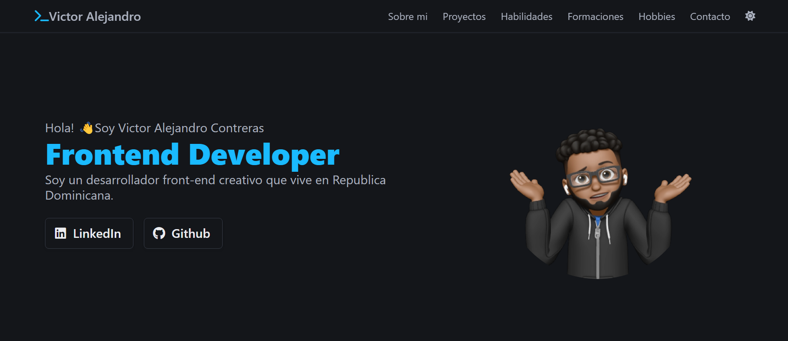

<h1 align="center">Portafolio Web</h1>
<h3 align="center"></h3>

    ¡Bienvenido a mi portafolio! <a href="https://vc743.github.io/portafolio/">Aquí</a> encontrarás un vistazo a mi trabajo y mi pasión por el desarrollo frontend. Explora, descubre y siéntete libre de ponerte en contacto para cualquier pregunta o colaboración. ¡Espero que disfrutes tu visita! 🚀.

👀Creo que todavia puedo mejorarlo asi que pienso hacerle algunos cambios.

<h3 align="left">Lenguajes y herramientas utilizadas:</h3>

      

<h3 align="left">Conecta conmigo:</h3>

